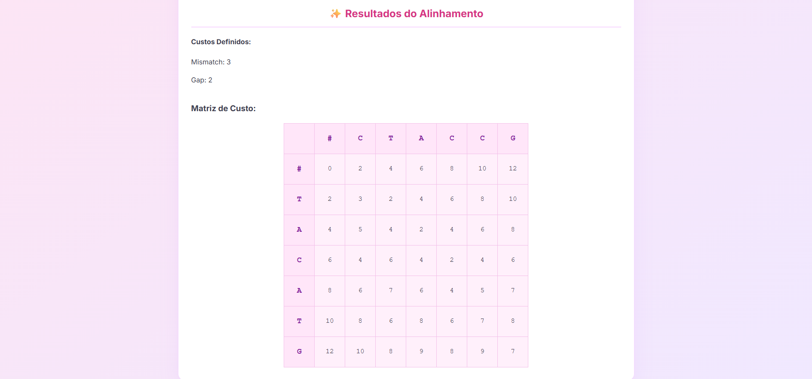
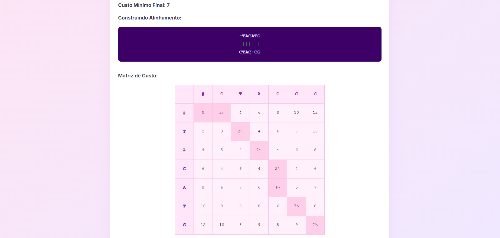

# PD_Rocha

**Número da Lista**: 5<br>
**Conteúdo da Disciplina**: Programação Dinâmica <br>

## Alunos
|Matrícula | Aluno |
| -- | -- |
| 22/2022000 |  Milena Fernandes Rocha |
| 20/2045348  |  Ingrid Alves Rocha |

## Sobre 

Este projeto tem como objetivo demonstrar, de forma visual e interativa, o funcionamento do algoritmo Align Sequence baseado em programação dinâmica iterativa.
O foco está em mostrar como o algoritmo calcula o menor custo de alinhamento entre duas palavras, considerando três operações principais:<br>
Match: quando os caracteres são iguais;<br>
Mismatch: quando os caracteres são diferentes;<br>
Gap: quando há inserção ou remoção de caracteres.<br>
Através da interface, é possível inserir as palavras, ajustar os pesos dessas operações e visualizar tanto a matriz de custo quanto uma das possíveis soluções de alinhamento.

## Instalação 
**Linguagem**: HTML, CSS e Javascript<br>
**Ferramentas**: GitHub e GitPages<br>
**Como rodar**: 
1. Faça o git clone do repositório: 
```bash
git clone https://github.com/projeto-de-algoritmos-2025/PD_Rocha
```
2. Abra a pasta no VScode
3. Clique em `GoLive` no canto inferior direito

ou 

1. Acesse nosso [deploy](https://projeto-de-algoritmos-2025.github.io/PD_Rocha/) sem necessitar de configurações
<br>

## Screenshots
<p align="center">
  <b>Página Inicial</b><br>
  
</p>
<p align="center">
  <b>Matriz Calculada</b><br>
  
</p>
<p align="center">
  <b>Percurso Feito</b><br>
  
</p>


## Uso 


1. Escolher duas palavras;
2. Definir os pesos de match, mismatch e gap;
3. Clicar em `Calcular Matriz do Custo` para gerar a matriz de custo;
4. Se desejar ver uma das formas que o algoritmo pode seguir para chegar ao custo mínimo, clique em `Visualizar Solução (Find Solution)`.

## Link do Vídeo

<div align="center">


[](https://youtu.be/gJgJkZsQNGk)

**Fonte:** [Milena Rocha](https://github.com/milenafrocha) e [Ingrid Alves](https://github.com/alvesingrid)
**Disponível em:** [https://youtu.be/gJgJkZsQNGk](https://youtu.be/gJgJkZsQNGk)
**Acesso em:** 14 de julho de 2025.


</div>

---

